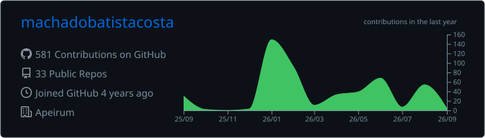
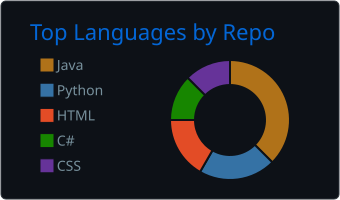
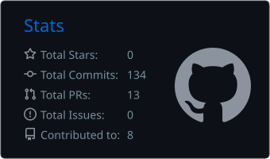

<h1>Caike Machado Batista Costa</h1>

  <strong>Software Engineer · AI Builder · Full-Stack Problem Solver</strong> 
  Building software since 2018 · Information Systems graduate from FURB · Brazil 🇧🇷

  
  
  

## About me

I am a software engineer who moves comfortably across languages, frameworks, databases, and layers of a system—from enterprise ERP modules and integrations to model inference, data pipelines, backend services, APIs, and user-facing products.

I do not define myself by a single stack. I break down the problem, understand the codebase, choose the right tools, and deliver. I have worked with **Rust, Python, TypeScript, JavaScript, Java, C#, C++, PHP, SQL**, and other technologies across academic projects, professional work, and products.

I hold a degree in **Information Systems from FURB**. My background combines enterprise software, full-stack development, distributed systems, technical support, product engineering, and artificial intelligence.

## From first code to end-to-end engineering

| Stage | Experience |
| --- | --- |
| **GOVBR · 2018** | Started in technology as an intern, working with ERP development and maintenance using PHP 7 and Delphi |
| **Web projects · 2019–2020** | Built frontend projects in the Node.js ecosystem, expanding from enterprise maintenance into modern web development |
| **FURB · from 2021** | Entered Information Systems and deepened my foundation in Java, algorithms, software engineering, and relational databases through Database I and II |
| **ProWay / Entra21 · 2022** | Professional full-stack training in C# and .NET 6, including ASP.NET Core MVC, Entity Framework, SQL Server, layered architecture, and APIs |
| **Senior Sistemas · 2022–2023** | Progressed from the GoDev internship program to Software Developer, working with Java, Delphi, Vue, enterprise HR/ERP systems, integrations, Git, CI, API documentation, stability, and performance across SQL Server, Oracle, and PostgreSQL environments |
| **Private client work** | Delivered freelance software for a health-tech client, translating business requirements into a working digital product while preserving repository confidentiality |
| **Apeirum · current** | Founder and lead developer of a production AI platform, owning product and architecture across secure document-scoped RAG, source provenance, APIs and structured extraction, authentication, billing, queues, observability, testing, infrastructure, and market validation |

**Selected training:** Java OOP, ASP.NET Core MVC, Java microservices with Spring Boot and Spring Cloud, MySQL, and full-stack web development.

This progression shaped how I work today: I am not locked into one language or layer. I can enter an unfamiliar codebase, learn the stack, connect the moving parts, and take a problem from discovery to production—with AI accelerating the work and engineering judgment guiding it.

## How I work

| Strength | What it means in practice |
| --- | --- |
| End-to-end ownership | From requirements and architecture to implementation, testing, deployment, and iteration |
| Language-agnostic development | I can enter an unfamiliar stack, understand its conventions, and become productive quickly |
| Systems thinking | I connect product needs with data, APIs, infrastructure, security, cost, and performance |
| AI-assisted engineering | I use Codex and other AI tools to explore codebases, prototype, refactor, test, and document faster |
| Product mindset | I focus on solving the real user and business problem—not only on writing code |

> AI accelerates my workflow; engineering judgment, validation, and responsibility remain mine.

## Selected work

| Project | What it demonstrates | Stack |
| --- | --- | --- |
| **PTBR-LLM** · private R&D | An RWKV v6/v7 language-model pipeline for Brazilian Portuguese, covering corpus cleaning and auditing, tokenizer training, streaming datasets, checkpoints, benchmarks, and local inference | Rust, Burn, PyTorch, RWKV, CUDA |
| **[MicroChefs](https://github.com/machadobatistacosta/Projeto-Sistemas-distribuidos)** | End-to-end ownership of an event-driven restaurant platform: Angular frontend, Java and .NET services, asynchronous messaging, service discovery, containers, and real-time order tracking | Angular, Java, Spring Boot, .NET, RabbitMQ, Eureka, PostgreSQL, Docker |
| **[ClimaWatch](https://github.com/machadobatistacosta/climawatch)** | Event-driven backend infrastructure with message queues, dead-letter handling, health checks, persistence, containers, and optional Telegram notifications | .NET 10, RabbitMQ, PostgreSQL, Docker |
| **[Graph & geospatial analysis](https://github.com/machadobatistacosta/Grafos)** | Road-network and public-service accessibility analysis using shortest paths, spatial data, interactive maps, and reproducible notebooks | Python, NetworkX, OSMnx, GeoPandas, Folium, Jupyter |

## Languages

  
  
  
  
  
  
  
  
  
  

## Frameworks, data & tools

  
  
  
  
  
  
  
  
  
  
  
  
  
  
  
  
  
  
  
  
  

## Areas where I build

- **Backend & APIs** — services, integrations, authentication, data modeling, and distributed workflows.
- **Full-stack products** — interfaces, dashboards, business flows, and production deployment.
- **AI engineering** — LLMs, RAG, embeddings, evaluation, data pipelines, and local inference.
- **Systems & performance** — Rust, memory-conscious software, latency, observability, and reliability.
- **Enterprise software** — internal systems, document-heavy processes, automation, and legacy integration.

## Current focus

- Building and operating **[Apeirum](https://apeirum.com.br)** as a secure AI product: hybrid and agentic RAG experiments, document isolation and provenance, structured-extraction APIs, billing, background processing, observability, and automated testing.
- Advancing **PTBR-LLM**, from data preparation and training to evaluation and efficient local inference.
- Using **Codex and AI-assisted development** to move faster across codebases and stacks without giving up review, tests, or engineering rigor.

## GitHub activity

  

  
  

---

  <strong>The stack is a decision. Solving the problem is the job.</strong> 
  Open to software engineering, AI, product, and technical partnership opportunities. 
  <a href="https://www.linkedin.com/in/caike-machado-batista-costa/">Let's connect on LinkedIn</a>.

